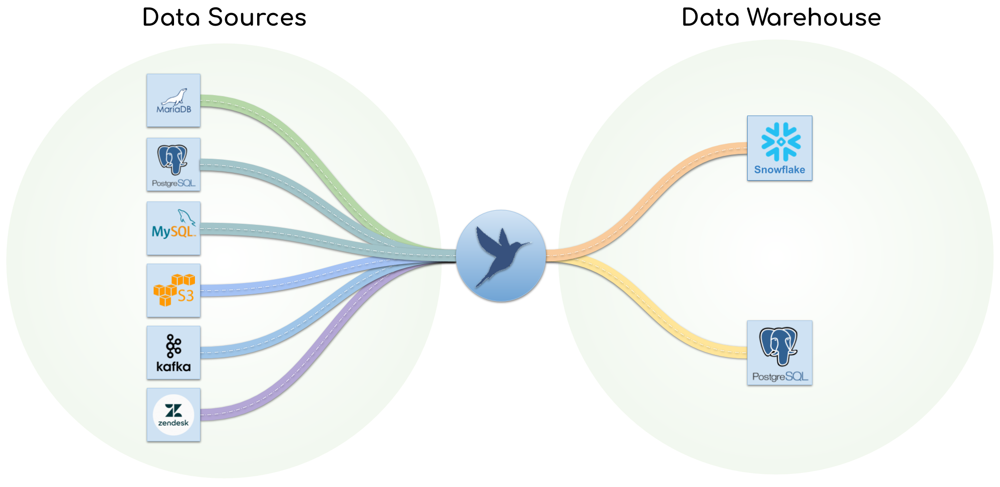

# PipelineWise

PipelineWise is a Python 3.12 framework for configuring, running, and operating
[Singer](https://github.com/singer-io/getting-started/blob/master/docs/SPEC.md)
ELT pipelines. It supports log-based, incremental, and full-table replication,
plus native FastSync transfers for selected database routes.

[Documentation](https://transferwise.github.io/pipelinewise/) ·
[Issues](https://github.com/transferwise/pipelinewise/issues) ·
[Docker images](https://hub.docker.com/r/transferwiseworkspace/pipelinewise)



## Project scope

Available sources are MariaDB and PostgreSQL; available targets are PostgreSQL
and Snowflake. Other packaged connectors, including the Snowflake source, are
experimental. `pipelinewise init` also generates some legacy templates that are
not packaged.

Release [`v0.64.1`](https://github.com/transferwise/pipelinewise/tree/v0.64.1)
is the last release from before the connector set was reduced. It is a historical
reference, not a recommendation to deploy an older release.

See the [connector support and route
matrix](https://transferwise.github.io/pipelinewise/connectors/index.html) before
creating a pipeline.

## Connectors

### Available

| Direction | Platform | Component |
|---|---|---|
| Source | MariaDB | `tap-mysql` |
| Source | PostgreSQL | `tap-postgres` |
| Target | PostgreSQL | `target-postgres` |
| Target | Snowflake | `target-snowflake` |

MariaDB and MySQL share `tap-mysql`; MariaDB is available while MySQL remains
experimental.

### Experimental

Packaged experimental sources are GitHub, Jira, Kafka, Mixpanel, MongoDB, MySQL,
S3 CSV, Salesforce, Slack, Snowflake, Twilio, and Zendesk. `target-s3-csv` is an
experimental target. Packaging means the component is included by
`make all_connectors`; it does not imply production support.

## Install with Docker

Docker is the recommended runtime because it isolates connector and system
dependencies:

```bash
git clone https://github.com/transferwise/pipelinewise.git
cd pipelinewise
docker pull transferwiseworkspace/pipelinewise:latest
docker tag transferwiseworkspace/pipelinewise:latest pipelinewise:latest
alias pipelinewise="$(pwd)/bin/pipelinewise-docker"
pipelinewise status
```

Pin a release tag instead of `latest` in production. To customise the image,
build it locally:

```bash
docker build -t pipelinewise:latest .
```

The wrapper persists generated configuration, state, and logs below
`~/.pipelinewise` on the host. Continue with the [installation and first-pipeline
guide](https://transferwise.github.io/pipelinewise/installation_guide/installation.html).

## Install from source

Source installations own Python, system-library, and connector compatibility.
Install the CLI and only the required connectors:

```bash
make pipelinewise
make connectors -e pw_connector=tap-postgres,target-snowflake
export PIPELINEWISE_HOME="$(pwd)"
source .virtualenvs/pipelinewise/bin/activate
pipelinewise status
```

Do not use a root `pip install` as a replacement for the Makefile workflow; it
does not create isolated connector environments.

## Develop and test

Use the [`dev-project`](dev-project/README.md) Docker environment for development,
tests, and verification wherever possible. It provides Linux, source databases,
targets, and the runtime layout closest to production.

Read the repository and scoped `AGENTS.md` files for the authoritative lint, unit,
connector, E2E, and documentation commands. Do not run bare `pytest tests/`; it
collects credentialed end-to-end tests.

## Contribute

See the [contribution
guide](https://transferwise.github.io/pipelinewise/project/contribution.html) and
[`CONTRIBUTING.md`](CONTRIBUTING.md). New connectors begin as experimental until
their ownership, compatibility, recovery, CI, and operated route are documented.

## License

PipelineWise core is licensed under Apache License 2.0. Packaged connectors can
use different licenses, including AGPL 3.0; the obligations of a distributed
image depend on every included component. See the [license
inventory](https://transferwise.github.io/pipelinewise/project/licenses.html)
and [`LICENSE`](LICENSE).
