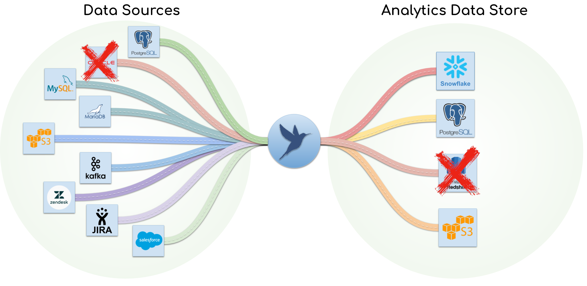

Documentation
=============

PipelineWise is a Data Pipeline Framework using the `Singer.io <https://www.singer.io/>`_ 
specification to replicate data from various sources to various destinations.

------------

Features
--------

- **Built with ELT in mind**: PipelineWise fits into the ELT landscape and not doing traditional ETL. ELT ingests data first into DWH in the original format and the "transformation" shifting to the end of the data pipeline. Load time transformations are still supported but complex mapping and joins have to be done once the data is replicated into the Data Warehouse. 
- **Lightweight**: No daemons or database setup are required
- **Replication Methods**: CDC (Log Based), Key-Based Incremental and Full Table snapshots
- **Managed Schema Changes**: When source data changes, PipelineWise detects the change and alters the schema in your DWH automatically
- **Load time transformations**: Ideal place to obfuscate, mask or filter sensitive data that should never been replicated in the Data Warehouse
- **YAML based configuration**: Data pipelines are defined as YAML files, which ensures that the entire configuration is kept under version control
- **Integration with external tools**: With built-in event handlers you can trigger external scripts automatically when a certain even occurred
- **Extensible**: PipelineWise is using `Singer.io <https://www.singer.io/>`_  compatible taps and target connectors and new connectors can be added to the system with relatively small effort

Beyond the Horizon
------------------

PipelineWise is built on top of several `Singer.io <https://www.singer.io/>`_ components. Singer.io components
are responsible to do certain tasks like extracting data from a specific data source or loading data into a
specific destination but to replicate data end to end you'll need have an extra layer on top these components to
run the jobs, make configurations, select streams to replicate, do logging and more.

This is where PipelineWise comes in place. PipelineWise is a collection of pre-selected singer taps and
targets and adds the required functionalities to create, run and maintain data pipelines in a production Data Warehouse
environment without the extra hassle.

Content
-------
.. toctree::
   :maxdepth: 2
   :caption: Installation

   installation_guide/installation
   installation_guide/creating_pipelines
   installation_guide/running_pipelines
   installation_guide/encrypting_passwords

.. toctree::
   :maxdepth: 2
   :caption: Concept

   concept/singer
   concept/replication_strategies

.. toctree::
   :maxdepth: 2
   :caption: Using PipelineWise

   user_guide/yaml_config
   user_guide/cli
   user_guide/fastsync
   user_guide/scheduling
   user_guide/integration
   user_guide/scaling
   user_guide/transformations

.. toctree::
   :maxdepth: 2
   :caption: Connectors

   connectors/taps
   connectors/targets

.. toctree::
   :maxdepth: 2
   :caption: Project

   project/about

Indices and tables
==================

* :ref:`genindex`
* :ref:`modindex`
* :ref:`search`
