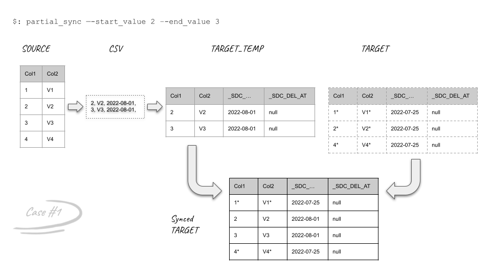
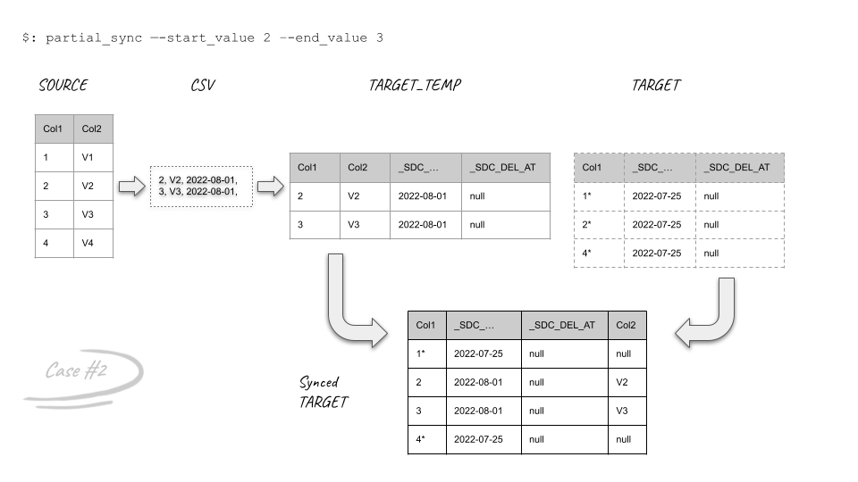
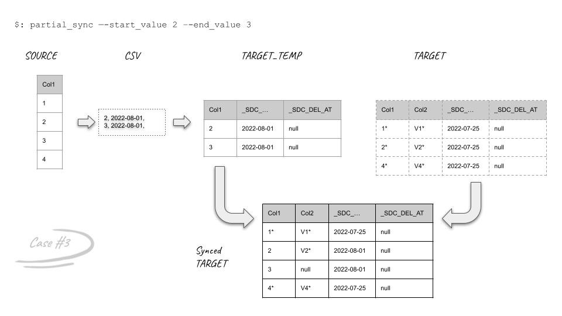
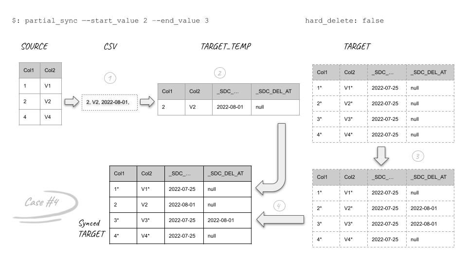
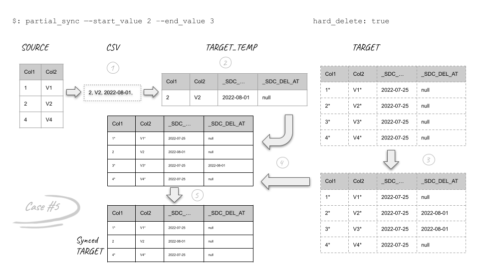
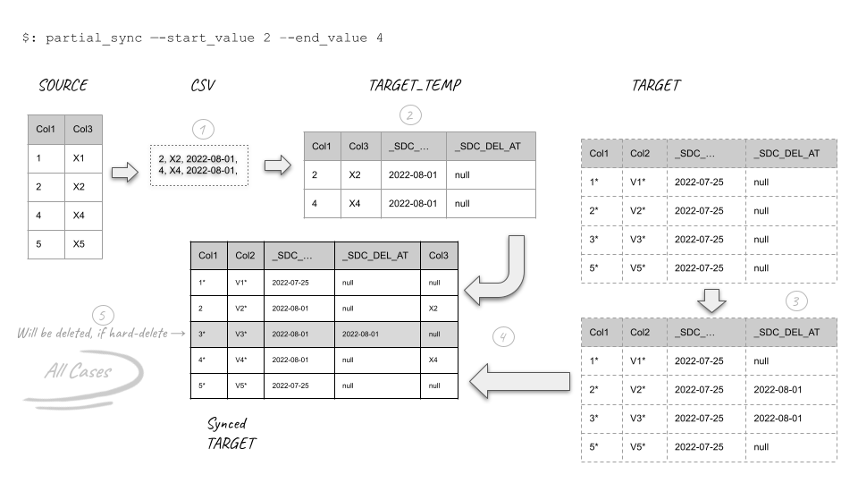

.. _partial_sync_cases:

Different cases of partial resync
=================================

1. **Normal**

This is the normal case which all source columns exist in the target.
after exporting data from the source into S3, a temp table will be created on Snowflake and then it will be merged
with the target table.

2. **Some columns are deleted from the target**

``Col2`` is deleted from the target. after merging the temp and target tables only rows 2 and 3 in the target will have
value.

3. **Some columns are deleted from the source**

In this example, ``Col2`` is removed from the source table and it causes the values for this column not be updated in
the synced table and row ``3`` has ``null`` value.

4. **Hard delete is disabled (soft delete)**

If ``hard_delete`` setting  is ``false`` the records which are deleted from the source, won't be deleted from the target. they
just will have a time stamp in meta column.

5. **Hard delete is enabled**

If ``hard_delete`` setting  is ``true`` the records which are deleted from the source, will be deleted from the target.

6. **Combination of all cases**

