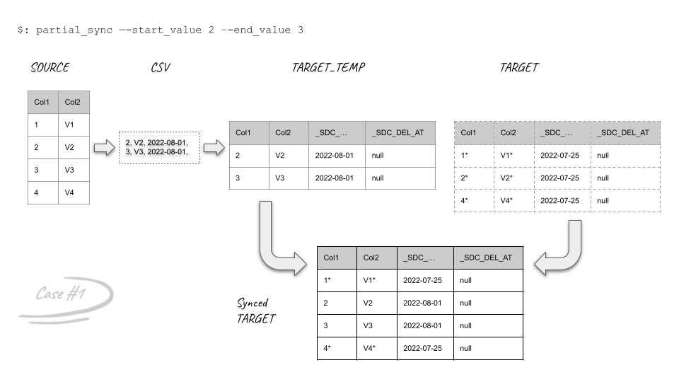
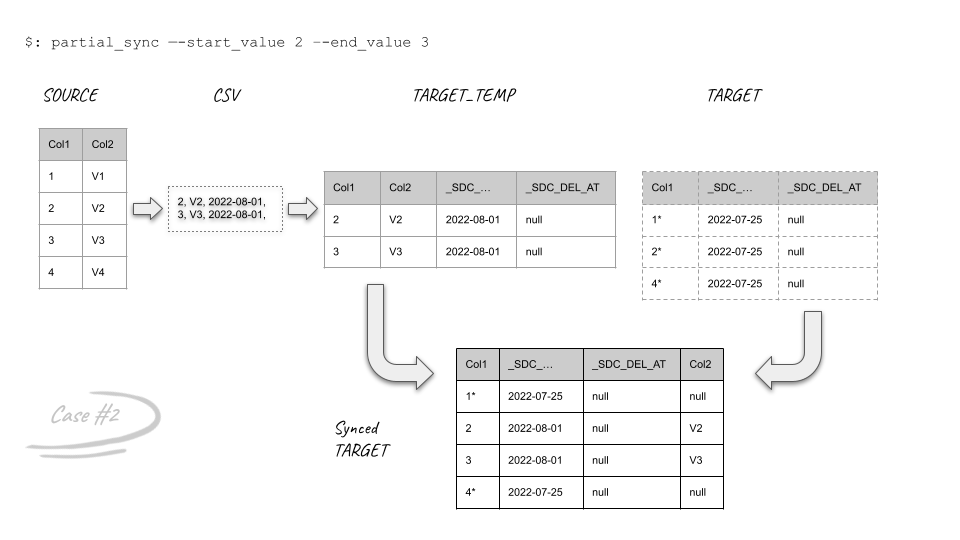
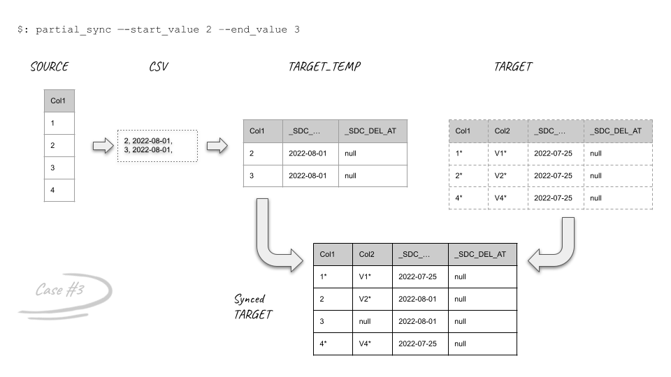
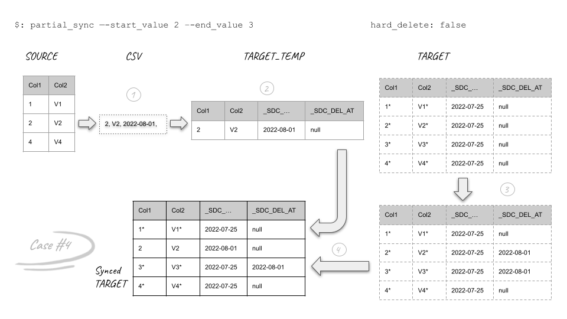
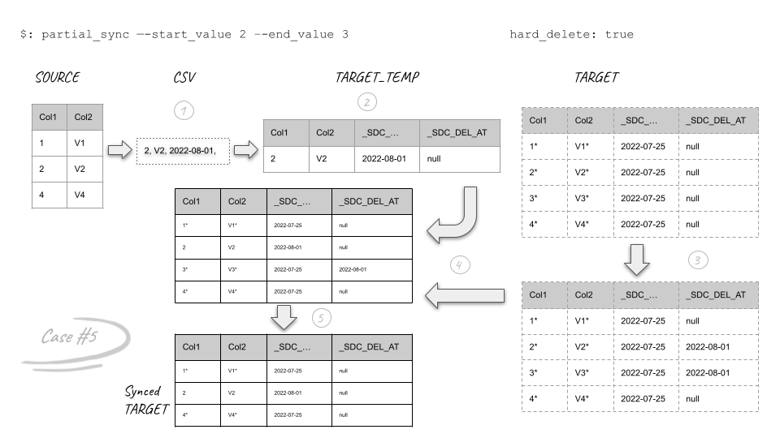
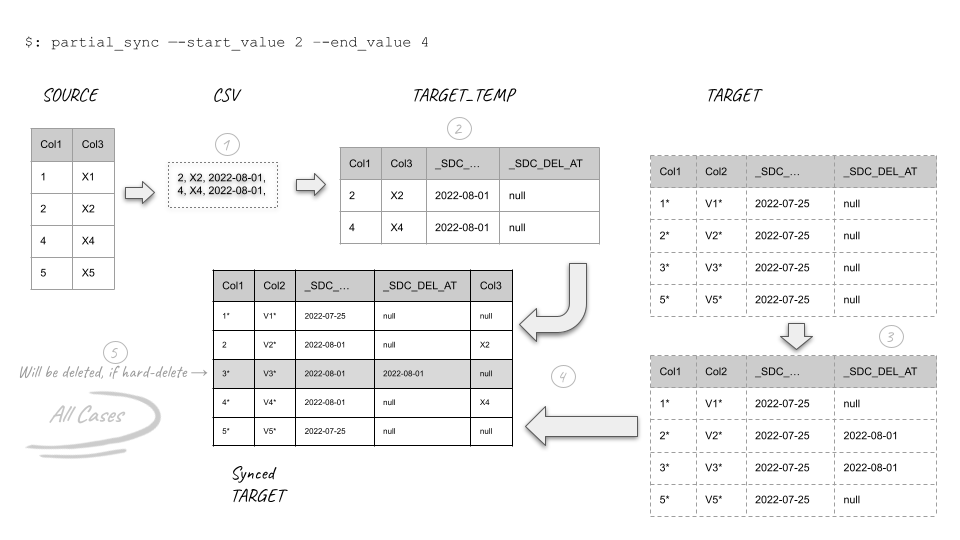

.. _partial_sync_cases:

Different cases of partial resync
=================================

Partial sync resyncs a specific range of rows from a source table into the target.
Data is exported from the source into a temporary staging area, loaded into a temp
table on the target, and then merged with the existing target table. The behaviour
varies depending on column differences and the ``hard_delete`` setting.

.. note::

   Partial sync uses the **PartialSync** component of :ref:`fast_sync_main`.
   It shares the same native database connectors as FullSync but applies a
   WHERE clause during export and merges (rather than replaces) the target data.

1. **Normal**

All source columns exist in the target. The exported rows are merged into the target
table, updating existing rows and inserting new ones. This is the standard case.

2. **Some columns are deleted from the target**

A column (e.g. ``Col2``) has been removed from the target table. After merging,
only the rows within the synced range will have values for that column — existing
rows outside the range retain their original data.

3. **Some columns are deleted from the source**

A column (e.g. ``Col2``) has been removed from the source table. Since the column
no longer exists in the exported data, merged rows will have ``NULL`` for that column
in the target. Rows outside the synced range are not affected.

4. **Hard delete is disabled (soft delete)**

.. deprecated::
   Soft delete (``hard_delete: false``) is scheduled for removal. New taps
   should use ``hard_delete: true`` exclusively.

When ``hard_delete`` is ``false``, rows that have been deleted from the source are
**not** removed from the target. Instead, they receive a timestamp in the
``_SDC_DELETED_AT`` metadata column indicating when the delete was detected.

5. **Hard delete is enabled**

When ``hard_delete`` is ``true``, rows that have been deleted from the source within
the synced range are physically removed from the target table.

6. **Combination of all cases**

This diagram shows the combined effect of column differences and delete handling
when all of the above scenarios overlap.
