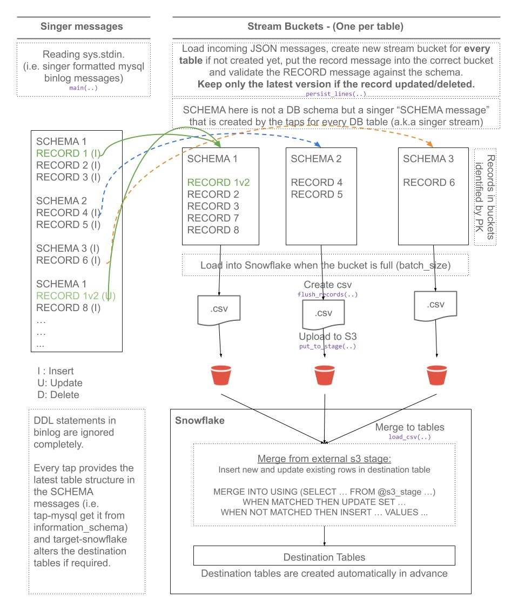

# pipelinewise-target-snowflake

[](https://badge.fury.io/py/pipelinewise-target-snowflake)
[](https://pypi.org/project/pipelinewise-target-snowflake/)
[](https://opensource.org/licenses/Apache-2.0)

[Singer](https://www.singer.io/) target that loads data into Snowflake following the [Singer spec](https://github.com/singer-io/getting-started/blob/master/docs/SPEC.md).

This is a [PipelineWise](https://transferwise.github.io/pipelinewise) compatible target connector.

## How to use it

The recommended method of running this target is to use it from [PipelineWise](https://transferwise.github.io/pipelinewise). When running it from PipelineWise you don't need to configure this tap with JSON files and most of things are automated. Please check the related documentation at [Target Snowflake](https://transferwise.github.io/pipelinewise/connectors/targets/snowflake.html)

If you want to run this [Singer Target](https://singer.io) independently please read further.

## Install

First, make sure Python 3 is installed on your system or follow these
installation instructions for [Mac](http://docs.python-guide.org/en/latest/starting/install3/osx/) or
[Ubuntu](https://www.digitalocean.com/community/tutorials/how-to-install-python-3-and-set-up-a-local-programming-environment-on-ubuntu-16-04).

It's recommended to use a virtualenv:

```bash
  python3 -m venv venv
  pip install pipelinewise-target-snowflake
```

or

```bash
  python3 -m venv venv
  . venv/bin/activate
  pip install --upgrade pip
  pip install .
```

## Flow diagram



### To run

Like any other target that's following the singer specificiation:

`some-singer-tap | target-snowflake --config [config.json]`

It's reading incoming messages from STDIN and using the properites in `config.json` to upload data into Snowflake.

**Note**: To avoid version conflicts run `tap` and `targets` in separate virtual environments.

### Pre-requirements

You need to create a few objects in snowflake in one schema before start using this target.

1. Create a named file format. This will be used by the MERGE/COPY commands to parse the files correctly from S3. You can use CSV or Parquet file formats.

To use CSV files:
```
CREATE FILE FORMAT {database}.{schema}.{file_format_name}
TYPE = 'CSV' ESCAPE='\\' FIELD_OPTIONALLY_ENCLOSED_BY='"';
```

To use Parquet files (experimental):

```
CREATE FILE FORMAT {database}.{schema}.{file_format_name} TYPE = 'PARQUET';
```

**Important:** Parquet files are not supported with [table stages](https://docs.snowflake.com/en/user-guide/data-load-local-file-system-create-stage.html#table-stages). If you want to use Parquet files then you need to have an external stage in snowflake. Please read further for more details in point 4).

2. Create a Role with all the required permissions:

```
CREATE OR REPLACE ROLE ppw_target_snowflake;
GRANT USAGE ON DATABASE {database} TO ROLE ppw_target_snowflake;
GRANT CREATE SCHEMA ON DATABASE {database} TO ROLE ppw_target_snowflake;

GRANT USAGE ON SCHEMA {database}.{schema} TO role ppw_target_snowflake;
GRANT USAGE ON STAGE {database}.{schema}.{stage_name} TO ROLE ppw_target_snowflake;
GRANT USAGE ON FILE FORMAT {database}.{schema}.{file_format_name} TO ROLE ppw_target_snowflake;
GRANT USAGE ON WAREHOUSE {warehouse} TO ROLE ppw_target_snowflake;
```

Replace `database`, `schema`, `warehouse`, `stage_name` and `file_format_name`
between `{` and `}` characters to the actual values from point 1 and 2.

3. Create a user and grant permission to the role:
```
CREATE OR REPLACE USER {user}
PASSWORD = '{password}'
DEFAULT_ROLE = ppw_target_snowflake
DEFAULT_WAREHOUSE = '{warehouse}'
MUST_CHANGE_PASSWORD = FALSE;

GRANT ROLE ppw_target_snowflake TO USER {user};
```

Replace `warehouse` between `{` and `}` characters to the actual values from point 3.

4. **Optional external stage**:

By default [table stages](https://docs.snowflake.com/en/user-guide/data-load-local-file-system-create-stage.html#table-stages) are used to load data into snowflake tables. If you want to use external stages with s3 or s3 compatible storage engines then you need to create a STAGE object:

```
CREATE STAGE {database}.{schema}.{stage_name}
url='s3://{s3_bucket}'
credentials=(AWS_KEY_ID='{aws_key_id}' AWS_SECRET_KEY='{aws_secret_key}')
encryption=(MASTER_KEY='{client_side_encryption_master_key}');
GRANT USAGE ON STAGE {database}.{schema}.{stage_name} TO ROLE ppw_target_snowflake;
```

Notes:
* To use external stages you need to define `s3_bucket` and `stage` values in `config.json` as well.
* The `encryption` option is optional and used for client side encryption.
* If you want client side encryption enabled you need to define the same master key in the target `config.json`.
* Instead of `credentials` you can also use [storage_integration](https://docs.snowflake.com/en/sql-reference/sql/create-storage-integration.html)

Further details below in the Configuration settings section.

### Configuration settings

Running the the target connector requires a `config.json` file. Example with the minimal settings:

   ```json
   {

     "account": "rtxxxxx.eu-central-1",
     "dbname": "database_name",
     "user": "my_user",
     "password": "password",
     "warehouse": "my_virtual_warehouse",
     "file_format": "snowflake_file_format_object_name",
     "default_target_schema": "my_target_schema"
   }
   ```

Full list of options in `config.json`:

| Property                            | Type    | Required?  | Description                                                   |
|-------------------------------------|---------|------------|---------------------------------------------------------------|
| account                             | String  | Yes        | Snowflake account name (i.e. rtXXXXX.eu-central-1)            |
| dbname                              | String  | Yes        | Snowflake Database name                                       |
| user                                | String  | Yes        | Snowflake User                                                |
| password                            | String  | Yes        | Snowflake Password                                            |
| warehouse                           | String  | Yes        | Snowflake virtual warehouse name                              |
| role                                | String  | No         | Snowflake role to use. If not defined then the user's default role will be used |
| aws_access_key_id                   | String  | No         | S3 Access Key Id. If not provided, `AWS_ACCESS_KEY_ID` environment variable or IAM role will be used |
| aws_secret_access_key               | String  | No         | S3 Secret Access Key. If not provided, `AWS_SECRET_ACCESS_KEY` environment variable or IAM role will be used |
| aws_session_token                   | String  | No         | AWS Session token. If not provided, `AWS_SESSION_TOKEN` environment variable will be used |
| aws_profile                         | String  | No         | AWS profile name for profile based authentication. If not provided, `AWS_PROFILE` environment variable will be used. |
| s3_bucket                           | String  | No         | S3 Bucket name. Required if to use S3 External stage. When this is defined then `stage` has to be defined as well. |
| s3_key_prefix                       | String  | No         | (Default: None) A static prefix before the generated S3 key names. Using prefixes you can upload files into specific directories in the S3 bucket. |
| s3_endpoint_url                     | String  | No         | The complete URL to use for the constructed client. This is allowing to use non-native s3 account. |
| s3_region_name                      | String  | No         | Default region when creating new connections |
| s3_acl                              | String  | No         | S3 ACL name to set on the uploaded files                                                   |
| stage                               | String  | No         | Named external stage name created at pre-requirements section. Has to be a fully qualified name including the schema name. If not specified, table internal stage are used. When this is defined then `s3_bucket` has to be defined as well. |
| file_format                         | String  | Yes        | Named file format name created at pre-requirements section. Has to be a fully qualified name including the schema name. |
| batch_size_rows                     | Integer |            | (Default: 100000) Maximum number of rows in each batch. At the end of each batch, the rows in the batch are loaded into Snowflake. |
| batch_wait_limit_seconds            | Integer |            | (Default: None) Maximum time to wait for batch to reach `batch_size_rows`. |
| flush_all_streams                   | Boolean |            | (Default: False) Flush and load every stream into Snowflake when one batch is full. Warning: This may trigger the COPY command to use files with low number of records, and may cause performance problems. |
| parallelism                         | Integer |            | (Default: 0) The number of threads used to flush tables. 0 will create a thread for each stream, up to parallelism_max. -1 will create a thread for each CPU core. Any other positive number will create that number of threads, up to parallelism_max. |
| parallelism_max                     | Integer |            | (Default: 16) Max number of parallel threads to use when flushing tables. |
| default_target_schema               | String  |            | Name of the schema where the tables will be created, **without** database prefix. If `schema_mapping` is not defined then every stream sent by the tap is loaded into this schema.    |
| default_target_schema_select_permission | String  |            | Grant USAGE privilege on newly created schemas and grant SELECT privilege on newly created tables to a specific role or a list of roles. If `schema_mapping` is not defined then every stream sent by the tap is granted accordingly.   |
| schema_mapping                      | Object  |            | Useful if you want to load multiple streams from one tap to multiple Snowflake schemas.<br><br>If the tap sends the `stream_id` in `<schema_name>-<table_name>` format then this option overwrites the `default_target_schema` value. Note, that using `schema_mapping` you can overwrite the `default_target_schema_select_permission` value to grant SELECT permissions to different groups per schemas or optionally you can create indices automatically for the replicated tables.<br><br> **Note**: This is an experimental feature and recommended to use via PipelineWise YAML files that will generate the object mapping in the right JSON format. For further info check a [PipelineWise YAML Example]
| disable_table_cache                 | Boolean |            | (Default: False) By default the connector caches the available table structures in Snowflake at startup. In this way it doesn't need to run additional queries when ingesting data to check if altering the target tables is required. With `disable_table_cache` option you can turn off this caching. You will always see the most recent table structures but will cause an extra query runtime. |
| client_side_encryption_master_key   | String  |            | (Default: None) When this is defined, Client-Side Encryption is enabled. The data in S3 will be encrypted, No third parties, including Amazon AWS and any ISPs, can see data in the clear. Snowflake COPY command will decrypt the data once it's in Snowflake. The master key must be 256-bit length and must be encoded as base64 string. |
| add_metadata_columns                | Boolean |            | (Default: False) Metadata columns add extra row level information about data ingestions, (i.e. when was the row read in source, when was inserted or deleted in snowflake etc.) Metadata columns are creating automatically by adding extra columns to the tables with a column prefix `_SDC_`. The column names are following the stitch naming conventions documented at https://www.stitchdata.com/docs/data-structure/integration-schemas#sdc-columns. Enabling metadata columns will flag the deleted rows by setting the `_SDC_DELETED_AT` metadata column. Without the `add_metadata_columns` option the deleted rows from singer taps will not be recongisable in Snowflake. |
| hard_delete                         | Boolean |            | (Default: False) When `hard_delete` option is true then DELETE SQL commands will be performed in Snowflake to delete rows in tables. It's achieved by continuously checking the  `_SDC_DELETED_AT` metadata column sent by the singer tap. Due to deleting rows requires metadata columns, `hard_delete` option automatically enables the `add_metadata_columns` option as well. |
| data_flattening_max_level           | Integer |            | (Default: 0) Object type RECORD items from taps can be loaded into VARIANT columns as JSON (default) or we can flatten the schema by creating columns automatically.<br><br>When value is 0 (default) then flattening functionality is turned off. |
| primary_key_required                | Boolean |            | (Default: True) Log based and Incremental replications on tables with no Primary Key cause duplicates when merging UPDATE events. When set to true, stop loading data if no Primary Key is defined. |
| validate_records                    | Boolean |            | (Default: False) Validate every single record message to the corresponding JSON schema. This option is disabled by default and invalid RECORD messages will fail only at load time by Snowflake. Enabling this option will detect invalid records earlier but could cause performance degradation. |
| temp_dir                            | String  |            | (Default: platform-dependent) Directory of temporary files with RECORD messages. |
| no_compression                      | Boolean |            | (Default: False) Generate uncompressed files when loading to Snowflake. Normally, by default GZIP compressed files are generated. |
| query_tag                           | String  |            | (Default: None) Optional string to tag executed queries in Snowflake. Replaces tokens `{{database}}`, `{{schema}}` and `{{table}}` with the appropriate values. The tags are displayed in the output of the Snowflake `QUERY_HISTORY`, `QUERY_HISTORY_BY_*` functions. |
| archive_load_files                  | Boolean |            | (Default: False) When enabled, the files loaded to Snowflake will also be stored in `archive_load_files_s3_bucket` under the key `/{archive_load_files_s3_prefix}/{schema_name}/{table_name}/`. All archived files will have `tap`, `schema`, `table` and `archived-by` as S3 metadata keys. When incremental replication is used, the archived files will also have the following S3 metadata keys: `incremental-key`, `incremental-key-min` and `incremental-key-max`. 
| archive_load_files_s3_prefix        | String  |            | (Default: "archive") When `archive_load_files` is enabled, the archived files will be placed in the archive S3 bucket under this prefix.
| archive_load_files_s3_bucket        | String  |            | (Default: Value of `s3_bucket`) When `archive_load_files` is enabled, the archived files will be placed in this bucket.

### To run tests:

1. Define the environment variables that are required to run the tests by creating a `.env` file in `tests/integration`, or by exporting the variables below.
```
  export TARGET_SNOWFLAKE_ACCOUNT=<snowflake-account-name>
  export TARGET_SNOWFLAKE_DBNAME=<snowflake-database-name>
  export TARGET_SNOWFLAKE_USER=<snowflake-user>
  export TARGET_SNOWFLAKE_PASSWORD=<snowflake-password>
  export TARGET_SNOWFLAKE_WAREHOUSE=<snowflake-warehouse>
  export TARGET_SNOWFLAKE_SCHEMA=<snowflake-schema>
  export TARGET_SNOWFLAKE_AWS_ACCESS_KEY=<aws-access-key-id>
  export TARGET_SNOWFLAKE_AWS_SECRET_ACCESS_KEY=<aws-access-secret-access-key>
  export TARGET_SNOWFLAKE_S3_ACL=<s3-target-acl>
  export TARGET_SNOWFLAKE_S3_BUCKET=<s3-external-bucket>
  export TARGET_SNOWFLAKE_S3_KEY_PREFIX=<bucket-directory>
  export TARGET_SNOWFLAKE_STAGE=<stage-object-with-schema-name>
  export TARGET_SNOWFLAKE_FILE_FORMAT_CSV=<file-format-csv-object-with-schema-name>
  export TARGET_SNOWFLAKE_FILE_FORMAT_PARQUET=<file-format-parquet-object-with-schema-name>
  export CLIENT_SIDE_ENCRYPTION_MASTER_KEY=<client_side_encryption_master_key>
```

2. Install python test dependencies in a virtual env and run unit and integration tests
```
  python3 -m venv venv
  . venv/bin/activate
  pip install --upgrade pip
  pip install .[test]
```

3. To run unit tests:
```
  pytest tests/unit
```

4. To run integration tests:
```
  pytest tests/integration
```

### To run pylint:

1. Install python dependencies and run python linter
```
  python3 -m venv venv
  . venv/bin/activate
  pip install --upgrade pip
  pip install .[test]
  pylint target_snowflake
```

## License

Apache License Version 2.0

See [LICENSE](LICENSE) to see the full text.
